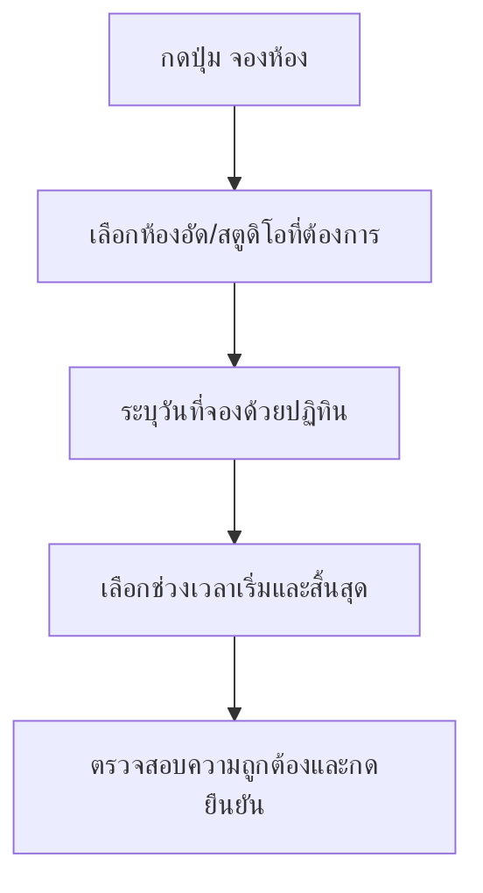

# คู่มือการใช้งานระบบจองห้องผลิตสื่อดิจิทัล (User Manual)
ยินดีต้อนรับสู่ระบบจองห้องผลิตสื่อดิจิทัล มหาวิทยาลัยนอร์ทกรุงเทพ คู่มือนี้จัดทำขึ้นเพื่อแนะนำการใช้งานระบบสำหรับผู้ใช้ทั้ง 2 กลุ่มหลัก คือ อาจารย์/นักศึกษา และเจ้าหน้าที่ดูแลระบบ (Admin)

---

## ส่วนที่ 1: คู่มือสำหรับอาจารย์/นักศึกษา (User Guide)

อาจารย์และนักศึกษาสามารถเข้าใช้งานระบบเพื่อตรวจสอบสถานะห้องและทำรายการจองห้องออนไลน์สำหรับบันทึกสื่อการสอนหรือบทเรียนดิจิทัลได้ตามขั้นตอนดังนี้

### 1. การเข้าสู่ระบบ (Login)
1. เข้าไปที่หน้าเข้าสู่ระบบผ่านเว็บเบราว์เซอร์
2. กรอก **อีเมล** และ **รหัสผ่าน** (ใช้ชุดข้อมูลเดียวกันกับบัญชีระบบ e-Learning ของมหาวิทยาลัย)
3. กดปุ่ม **"เข้าสู่ระบบ"**
4. *หมายเหตุสำหรับการล็อกอินครั้งแรก:* หากเป็นบัญชีที่เพิ่มโดยแอดมิน ระบบจะบังคับให้เปลี่ยนรหัสผ่านใหม่เพื่อความปลอดภัย ให้กรอกรหัสผ่านเดิมและตั้งรหัสผ่านใหม่เพื่อเข้าใช้งานหลัก

> [!TIP]
> หากใช้งานในสภาพแวดล้อมที่มืดหรือต้องการความสบายตา สามารถกดปุ่มสลับธีม ☀️ / 🌙 ที่มุมบนขวาของหน้าจอเพื่อสลับโหมดการแสดงผล (Light/Dark Mode) ได้ตลอดเวลา

---

### 2. การเช็กตารางห้องว่างและปฏิทินการจอง
หลังจากล็อกอินสำเร็จ คุณจะถูกนำไปยังหน้าแรก (Dashboard) เพื่อเช็กข้อมูลต่างๆ:
- **แถบแสดงสถานะห้องวันนี้**: จะมีกล่องสถานะของห้องอัดแต่ละห้อง ได้แก่:
  - **ว่าง (สีเขียว)**: สามารถกดจองได้ทันที
  - **ไม่ว่าง (สีแดง)**: มีผู้อื่นจองใช้งานในช่วงเวลาปัจจุบันแล้ว
  - **ปิดปรับปรุง (สีเหลือง)**: ปิดระบบชั่วคราว ไม่สามารถจองใช้งานได้
- **ตารางแสดงการจองของฉัน**: แสดงรายการสถานะคำขอจองปัจจุบันของคุณ (รออนุมัติ, อนุมัติแล้ว, ถูกปฏิเสธ, ยกเลิกแล้ว)

---

### 3. ขั้นตอนการทำรายการจองห้องเรียนออนไลน์ล่วงหน้า
เมื่อพร้อมทำการจอง ให้ปฏิบัติตามขั้นตอนต่อไปนี้:

1. กดปุ่ม **"จองห้อง"** บนแถบเมนูด้านบน
2. **เลือกห้องที่ต้องการใช้งาน**: จะแสดงรายการห้องพร้อมความจุจำนวนคน ให้คลิกเลือกห้องที่ต้องการ
3. **เลือกวันที่จอง**: คลิกที่ช่อง **"วันที่"** เพื่อเปิดปฏิทินเลือกวันที่ต้องการจองล่วงหน้า 
   *(ระบบรองรับการจองล่วงหน้าได้อย่างอิสระ แต่จะไม่อนุญาตให้เลือกวันย้อนหลัง วันเสาร์-อาทิตย์ หรือวันหยุดพิเศษ)*
4. **ระบุช่วงเวลาใช้งาน**:
   - เลือก **เวลาเริ่ม** และ **เวลาสิ้นสุด** (กำหนดให้จองได้เฉพาะในช่วงเวลาทำการ **08:30–17:00 น.** เท่านั้น)
5. กดปุ่ม **"ยืนยันจอง"** เพื่อส่งคำขอไปยังแอดมิน
6. สถานะจะขึ้นเป็น **"รออนุมัติ"** ระบบจะส่งอีเมลแจ้งเตือนเมื่อคำขอของคุณได้รับการพิจารณาอนุมัติหรือปฏิเสธ

---

### 4. การแจ้งซ่อมอุปกรณ์หรือห้อง (Maintenance Report)
หากพบปัญหาในการใช้งานห้องหรืออุปกรณ์ชำรุด สามารถแจ้งซ่อมได้ตามขั้นตอนดังนี้:
1. กดปุ่ม **"แจ้งซ่อม"** (รูปประแจ) บนแถบเมนูด้านบน หรือสแกน QR Code แจ้งซ่อม
2. เลือก **ห้องที่มีปัญหา** จากรายการ
3. ระบุ **ระดับความเร่งด่วน** (ต่ำ, ปกติ, สูง, เร่งด่วนมาก)
4. กรอก **รายละเอียดปัญหา** ให้ชัดเจน เช่น "ไมโครโฟนส่งเสียงรบกวน" หรือ "หลอดไฟดับ"
5. กดปุ่ม **"ส่งเรื่องแจ้งซ่อม"**
6. คุณสามารถติดตามสถานะการแจ้งซ่อมของตนเองได้ในส่วน "ประวัติการแจ้งซ่อมของฉัน" ซึ่งจะแสดงสถานะปัจจุบัน (รอดำเนินการ, กำลังดำเนินการ, เสร็จสิ้น)

---

## ส่วนที่ 2: คู่มือสำหรับเจ้าหน้าที่ (Admin Manual)

เจ้าหน้าที่แอดมินมีหน้าที่ควบคุมภาพรวมของระบบ ตรวจสอบความถูกต้องของการใช้งานห้อง และจัดการข้อมูลต่างๆ ภายในวิทยาเขต

### 1. การดูตารางภาพรวมระบบ (Admin Dashboard Overview)
1. เมื่อลงชื่อเข้าใช้ด้วยบัญชีแอดมิน คุณจะเข้าสู่ **Admin Dashboard**
2. หน้าจอหลักจะแสดง **สรุปสถิติสำคัญประจำวัน** ได้แก่:
   - จำนวนคำขอจองคิวใหม่ที่รอการดำเนินการอนุมัติ
   - รายการจองที่อนุมัติใช้ห้องแล้วในวันนี้
   - ยอดการเข้าใช้งานห้องบ่อยที่สุดแยกตามรายห้องและรายบุคคล
3. ในแถบ **"การแจ้งเตือนล่าสุด"** จะแสดงความเคลื่อนไหวทันทีที่มีคนจองห้องเข้ามาใหม่

---

### 2. ขั้นตอนการพิจารณาอนุมัติหรือปฏิเสธคำขอจอง
แอดมินสามารถประมวลผลคำขอจองได้อย่างมีประสิทธิภาพด้วย 2 วิธีการ:

#### วิธีที่ 1: อนุมัติผ่านรายการแบบเร็ว (Quick Actions)
- In the tab **"คำขอจอง"** ให้เลือกกรองสถานะเป็น **"รออนุมัติ"**
- ระบบจะมีปุ่มด่วน **"อนุมัติ" (สีเขียว)** และ **"ปฏิเสธ" (สีแดง)** บนบรรทัดคำขอนั้นโดยตรง
- แอดมินสามารถคลิกทำรายการได้ทันที ระบบจะอัปเดตข้อมูลขึ้นหน้าเว็บแบบ Real-time ทันทีโดยไม่ต้องโหลดหน้าเว็บใหม่

#### วิธีที่ 2: อนุมัติหลังตรวจรายละเอียดเชิงลึก
- คลิกที่ข้อความ **"ดูรายละเอียด"** ท้ายรายการที่ต้องการตรวจสอบ
- หน้าต่างข้อมูลจะป๊อปอัปแสดงชื่อ-นามสกุล, อีเมล, วันที่และเวลาใช้งานของผู้นั้น
- กดปุ่ม **"อนุมัติ"** หรือ **"ปฏิเสธ"** ด้านล่างสุดของหน้าต่างรายละเอียดตามความเหมาะสม

> [!WARNING]
> หากแอดมินทำรายการปฏิเสธคำขอจองห้องคิวนั้นๆ ระบบจะนำข้อมูลช่วงเวลาดังกล่าวไปประมวลผลระบบคิว (Queue) แบบอัตโนมัติ เพื่อส่งเมลแจ้งเตือนคิวถัดไปที่เข้ามารอจองห้องในเวลาเดียวกันทันที

---

### 3. การจัดการข้อมูลห้องอัด/สตูดิโอ และข้อมูลวันหยุดพิเศษ
แอดมินสามารถบริหารจัดการทรัพยากรห้องและปฏิทินทำงานผ่านแท็บต่างๆ:

#### การเพิ่ม/แก้ไขข้อมูลห้องอัด:
1. ไปที่แท็บ **"ห้อง"**
2. หากต้องการเพิ่มห้องใหม่: กรอกข้อมูล **ชื่อห้อง**, **ความจุ** และ **รายละเอียดห้อง** ในแบบฟอร์มด้านบน แล้วกด **"เพิ่มห้อง"**
3. หากต้องการปิดระบบบริการห้องชั่วคราว: สามารถแก้ไขสถานะของห้องนั้นเป็น **"ปิดปรับปรุง" (Maintenance)** ได้ทันที เพื่อกันไม่ให้ผู้ใช้คนอื่นจองห้องในช่วงนั้น

#### การจัดการปฏิทินวันหยุดพิเศษของมหาวิทยาลัย:
1. ไปที่แท็บ **"วันหยุด"**
2. เลือกวันที่ที่ต้องการประกาศผ่าน Date Picker ในส่วน **"เพิ่มวันหยุดพิเศษ"**
3. ใส่คำอธิบาย เช่น *"วันปีใหม่"*, *"วันวิสาขบูชา"* แล้วกดปุ่ม **"+ เพิ่ม"**
4. ข้อมูลวันหยุดจะอัปเดตเข้าระบบทันที และระบบจะไม่อนุญาตให้นักศึกษา/อาจารย์จองใช้งานห้องในวันหยุดดังกล่าว

---

### 4. การจัดการรายการแจ้งซ่อม (Maintenance Management)
แอดมินสามารถตรวจสอบและอัปเดตสถานะการแจ้งซ่อมอุปกรณ์หรือห้องได้ที่แท็บ **"แจ้งซ่อม"**:
1. ไปที่แท็บ **"แจ้งซ่อม"** (รูปประแจ) บน Admin Dashboard
2. ระบบจะแสดงรายการแจ้งซ่อมทั้งหมดจากผู้ใช้งาน พร้อมระบุ ห้อง, ผู้แจ้ง, รายละเอียดปัญหา, ความเร่งด่วน และวันที่แจ้ง
3. แอดมินสามารถเปลี่ยนสถานะของการแจ้งซ่อมได้โดยตรงผ่าน Dropdown ในคอลัมน์ "จัดการ" 
   - **รอดำเนินการ**: เมื่อได้รับแจ้งเรื่องใหม่
   - **กำลังดำเนินการ**: เมื่อช่างหรือเจ้าหน้าที่กำลังเข้าไปแก้ไข
   - **เสร็จสิ้น**: เมื่อปัญหาได้รับการแก้ไขเรียบร้อยแล้ว
