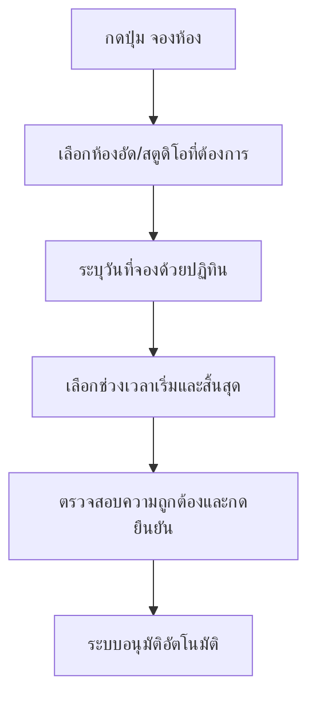

# คู่มือการใช้งานระบบจองห้องผลิตสื่อดิจิทัล (User Manual)
ยินดีต้อนรับสู่ระบบจองห้องผลิตสื่อดิจิทัล มหาวิทยาลัยนอร์ทกรุงเทพ คู่มือนี้จัดทำขึ้นเพื่อแนะนำการใช้งานระบบสำหรับผู้ใช้ทั้ง 2 กลุ่มหลัก คือ อาจารย์/นักศึกษา และเจ้าหน้าที่ดูแลระบบ (Admin)

---

## ส่วนที่ 1: คู่มือสำหรับอาจารย์/นักศึกษา (User Guide)

อาจารย์และนักศึกษาสามารถเข้าใช้งานระบบเพื่อตรวจสอบสถานะห้องและทำรายการจองห้องออนไลน์สำหรับบันทึกสื่อการสอนหรือบทเรียนดิจิทัลได้ตามขั้นตอนดังนี้

### 1. การเข้าสู่ระบบ (Login)
1. เข้าไปที่หน้าเข้าสู่ระบบผ่านเว็บเบราว์เซอร์
2. กรอก **อีเมล** และ **รหัสผ่าน** (ใช้ชุดข้อมูลเดียวกันกับบัญชีระบบ e-Learning ของมหาวิทยาลัย)
3. กดปุ่ม **"เข้าสู่ระบบ"**
4. *หมายเหตุสำหรับการล็อกอินครั้งแรก:* หากเป็นบัญชีที่เพิ่มโดยแอดมิน ระบบจะบังคับให้เปลี่ยนรหัสผ่านใหม่เพื่อความปลอดภัย ให้กรอกรหัสผ่านเดิมและตั้งรหัสผ่านใหม่เพื่อเข้าใช้งานหลัก

> [!TIP]
> หากใช้งานในสภาพแวดล้อมที่มืดหรือต้องการความสบายตา สามารถกดปุ่มสลับธีม ☀️ / 🌙 ที่มุมบนขวาของหน้าจอเพื่อสลับโหมดการแสดงผล (Light/Dark Mode) ได้ตลอดเวลา

---

### 2. การเช็กตารางห้องว่างและปฏิทินการจอง
หลังจากล็อกอินสำเร็จ คุณจะถูกนำไปยังหน้าแรก (Dashboard) เพื่อเช็กข้อมูลต่างๆ:
- **แถบแสดงสถานะห้องวันนี้**: จะมีกล่องสถานะของห้องอัดแต่ละห้อง ได้แก่:
  - **ว่าง (สีเขียว)**: สามารถกดจองได้ทันที
  - **ไม่ว่าง (สีแดง)**: มีผู้อื่นจองใช้งานในช่วงเวลาปัจจุบันแล้ว
  - **ปิดปรับปรุง (สีเหลือง)**: ปิดระบบชั่วคราว ไม่สามารถจองใช้งานได้
- **ตารางแสดงการจองของฉัน**: แสดงรายการสถานะคำขอจองปัจจุบันของคุณ (รออนุมัติ, อนุมัติแล้ว, ถูกปฏิเสธ, ยกเลิกแล้ว)

---

### 3. ขั้นตอนการทำรายการจองห้องเรียนออนไลน์ล่วงหน้า
เมื่อพร้อมทำการจอง ให้ปฏิบัติตามขั้นตอนต่อไปนี้:

1. กดปุ่ม **"จองห้องนี้"** บนการ์ดห้องที่ต้องการ
2. **เลือกวันที่จอง**: คลิกที่ช่อง **"วันที่"** เพื่อเปิดปฏิทินเลือกวันที่ต้องการจองล่วงหน้า
   *(ระบบรองรับการจองล่วงหน้าได้อย่างอิสระ แต่จะไม่อนุญาตให้เลือกวันย้อนหลัง วันเสาร์-อาทิตย์ หรือวันหยุดพิเศษ)*
3. **ระบุช่วงเวลาใช้งาน**:
   - เลือก **เวลาเริ่ม** และ **เวลาสิ้นสุด** (กำหนดให้จองได้เฉพาะในช่วงเวลาทำการ **08:30–17:00 น.** เท่านั้น)
   - **ข้อจำกัด**: จองได้สูงสุด **3 ชั่วโมง** ต่อครั้ง และ **1 ครั้ง** ต่อวัน
4. **เลือกห้องที่ต้องการ**: จะแสดงรายการห้องพร้อมความจุจำนวนคนและสถานะความว่างในวันที่เลือก
5. กดปุ่ม **"ยืนยันจอง"**
6. ระบบจะ **อนุมัติการจองอัตโนมัติ** ทันที และส่งอีเมลยืนยันการจองให้คุณ

> [!NOTE]
> **ระบบอนุมัติอัตโนมัติ**: การจองห้องจะได้รับการอนุมัติทันทีโดยไม่ต้องรอการอนุมัติจากแอดมิน เพื่อความสะดวกในการใช้งาน

---

### 4. การแจ้งซ่อมอุปกรณ์หรือห้อง (Maintenance Report)
หากพบปัญหาในการใช้งานห้องหรืออุปกรณ์ชำรุด สามารถแจ้งซ่อมได้ตามขั้นตอนดังนี้:
1. กดปุ่ม **"แจ้งซ่อม"** หรือไปที่เมนู **"แจ้งซ่อม"** บน Dashboard
2. เลือก **ห้องที่มีปัญหา** จากรายการ
3. ระบุ **ระดับความเร่งด่วน** (ต่ำ, ปกติ, สูง, เร่งด่วนมาก)
4. กรอก **รายละเอียดปัญหา** ให้ชัดเจน เช่น "ไมโครโฟนส่งเสียงรบกวน" หรือ "หลอดไฟดับ"
5. กดปุ่ม **"ส่งเรื่องแจ้งซ่อม"**
6. ระบบจะส่งอีเมลแจ้งเตือนไปยังแอดมินทันที
7. คุณสามารถติดตามสถานะการแจ้งซ่อมของตนเองได้ในส่วน "ประวัติการแจ้งซ่อมของฉัน" ซึ่งจะแสดงสถานะปัจจุบัน (รอดำเนินการ, กำลังดำเนินการ, เสร็จสิ้น, ถูกปฏิเสธ)

---

### 5. การใช้งานระบบคิวรอจอง (Queue System)
หากช่วงเวลาที่ต้องการจองถูกจองไปแล้ว คุณสามารถเข้าคิวรอจองได้:
1. เมื่อพบว่าช่วงเวลาที่ต้องการไม่ว่าง ให้กดปุ่ม **"เข้าคิว"**
2. ระบบจะบันทึกคำขอรอจองของคุณ
3. เมื่อมีการยกเลิกการจองในช่วงเวลาดังกล่าว ระบบจะแจ้งเตือนคนแรกในคิวทันที
4. คุณจะได้รับการแจ้งเตือนผ่านระบบและอีเมล พร้อมเวลา 15 นาทีในการทำการจอง

---

### 6. การตรวจสอบการแจ้งเตือน (Notifications)
ระบบจะส่งการแจ้งเตือนต่างๆ ให้คุณทราบ:
- **การแจ้งเตือนการจอง**: เมื่อมีการจองใหม่หรือการยกเลิก
- **การแจ้งเตือนคิว**: เมื่อช่วงเวลาที่รอจองว่างแล้ว
- **การแจ้งเตือนจองห้อง**: เมื่อแอดมินส่งประกาศสำคัญ

คุณสามารถตรวจสอบการแจ้งเตือนได้โดยกดปุ่ม **ระฆัง** ที่มุมขวาบนของหน้าจอ

---

### 7. การเปลี่ยนรหัสผ่าน
คุณสามารถเปลี่ยนรหัสผ่านได้ตลอดเวลา:
1. กดปุ่ม **"ออกจากระบบ"** แล้วเข้าสู่ระบบใหม่
2. หรือใช้ฟังก์ชันเปลี่ยนรหัสผ่านในหน้า Dashboard (หากมี)
3. กรอกรหัสผ่านปัจจุบันและรหัสผ่านใหม่ (ความยาวไม่น้อยกว่า 6 ตัวอักษร)
4. กดปุ่ม **"เปลี่ยนรหัสผ่าน"**

> [!TIP]
> หากลืมรหัสผ่าน สามารถกด **"ลืมรหัสผ่าน?"** ที่หน้าล็อกอิน ระบบจะส่งลิงก์รีเซ็ตรหัสผ่านไปยังอีเมลของคุณ

---

## ส่วนที่ 2: คู่มือสำหรับเจ้าหน้าที่ (Admin Manual)

เจ้าหน้าที่แอดมินมีหน้าที่ควบคุมภาพรวมของระบบ ตรวจสอบความถูกต้องของการใช้งานห้อง และจัดการข้อมูลต่างๆ ภายในวิทยาเขต

### 1. การดูตารางภาพรวมระบบ (Admin Dashboard Overview)
1. เมื่อลงชื่อเข้าใช้ด้วยบัญชีแอดมิน คุณจะเข้าสู่ **Admin Dashboard**
2. หน้าจอหลักจะแสดง **สรุปสถิติสำคัญ** ได้แก่:
   - อัตราการอนุมัติการจอง (เปอร์เซ็นต์)
   - จำนวนการจองทั้งหมด
   - จำนวนวันหยุดพิเศษที่กำหนด
3. ในแถบ **"การแจ้งเตือน"** จะแสดงความเคลื่อนไหวทันทีที่มีการจองใหม่ การแจ้งซ่อม หรือคำขอรีเซ็ตรหัสผ่าน

---

### 2. การดูและจัดการการจอง (Booking Management)
เนื่องจากระบบมีการอนุมัติอัตโนมัติ แอดมินสามารถตรวจสอบและจัดการการจองได้ดังนี้:

1. ไปที่แท็บ **"คำขอจอง"**
2. ระบบจะแสดงรายการการจองทั้งหมด สามารถกรองตามสถานะได้:
   - **ทั้งหมด**: แสดงทุกการจอง
   - **อนุมัติแล้ว**: การจองที่ได้รับการอนุมัติ
   - **ยกเลิกแล้ว**: การจองที่ถูกยกเลิกโดยผู้จอง
3. แอดมินสามารถดูรายละเอียดการจองแต่ละรายการ รวมถึงชื่อผู้จอง ห้องที่จอง วันที่และเวลา

> [!NOTE]
> **ระบบอนุมัติอัตโนมัติ**: การจองห้องจะได้รับการอนุมัติทันทีโดยระบบ แอดมินไม่ต้องทำการอนุมัติด้วยตนเอง แต่สามารถตรวจสอบและติดตามการจองได้

---

### 3. การจัดการข้อมูลห้องอัด/สตูดิโอ และข้อมูลวันหยุดพิเศษ
แอดมินสามารถบริหารจัดการทรัพยากรห้องและปฏิทินทำงานผ่านแท็บต่างๆ:

#### การจัดการข้อมูลห้องอัด:
1. ไปที่แท็บ **"ห้อง"**
2. จัดการห้องผ่านหน้า Dashboard หลัก (เพิ่ม/แก้ไข/ลบห้อง)
3. หากต้องการปิดระบบบริการห้องชั่วคราว: สามารถแก้ไขสถานะของห้องนั้นเป็น **"ปิดปรับปรุง" (Maintenance)** ได้ทันที เพื่อกันไม่ให้ผู้ใช้คนอื่นจองห้องในช่วงนั้น

#### การจัดการปฏิทินวันหยุดพิเศษของมหาวิทยาลัย:
1. ไปที่แท็บ **"วันหยุด"**
2. เลือกวันที่ที่ต้องการประกาศผ่าน Date Picker ในส่วน **"เพิ่มวันหยุดพิเศษ"**
3. ใส่คำอธิบาย เช่น *"วันปีใหม่"*, *"วันวิสาขบูชา"* แล้วกดปุ่ม **"+ เพิ่ม"**
4. ข้อมูลวันหยุดจะอัปเดตเข้าระบบทันที และระบบจะไม่อนุญาตให้นักศึกษา/อาจารย์จองใช้งานห้องในวันหยุดดังกล่าว
5. สามารถลบวันหยุดที่ไม่ต้องการได้โดยกดปุ่มถังขยะ

---

### 4. การจัดการรายการแจ้งซ่อม (Maintenance Management)
แอดมินสามารถตรวจสอบและอัปเดตสถานะการแจ้งซ่อมอุปกรณ์หรือห้องได้ที่แท็บ **"แจ้งซ่อม"**:
1. ไปที่แท็บ **"แจ้งซ่อม"** บน Admin Dashboard
2. ระบบจะแสดงรายการแจ้งซ่อมทั้งหมดจากผู้ใช้งาน พร้อมระบุ ห้อง, ผู้แจ้ง, รายละเอียดปัญหา, ความเร่งด่วน และวันที่แจ้ง
3. แอดมินสามารถดูสถานะปัจจุบันของแต่ละรายงาน:
   - **รอดำเนินการ**: เมื่อได้รับแจ้งเรื่องใหม่
   - **กำลังดำเนินการ**: เมื่อช่างหรือเจ้าหน้าที่กำลังเข้าไปแก้ไข
   - **เสร็จสิ้น**: เมื่อปัญหาได้รับการแก้ไขเรียบร้อยแล้ว
   - **ถูกปฏิเสธ**: เมื่อไม่สามารถดำเนินการได้

---

### 5. การจัดการผู้ใช้งาน (User Management)
แอดมินสามารถจัดการบัญชีผู้ใช้งานได้ที่แท็บ **"ผู้ใช้งาน"**:
1. ไปที่แท็บ **"ผู้ใช้งาน"**
2. ระบบจะแสดงรายชื่อผู้ใช้ทั้งหมด พร้อมข้อมูล ชื่อ, อีเมล, บทบาท (นักศึกษา/อาจารย์/แอดมิน), คณะ และหน่วยงาน
3. แอดมินสามารถ:
   - **เพิ่มผู้ใช้ใหม่**: สร้างบัญชีใหม่พร้อมบังคับเปลี่ยนรหัสผ่านครั้งแรก
   - **แก้ไขข้อมูลผู้ใช้**: อัปเดตข้อมูลส่วนตัว บทบาท หรือหน่วยงาน
   - **ลบผู้ใช้**: ลบบัญชีที่ไม่ต้องการออกจากระบบ

> [!IMPORTANT]
> เพื่อความปลอดภัย มีเฉพาะแอดมินเท่านั้นที่สามารถสร้างบัญชีผู้ใช้ใหม่ได้ ไม่มีหน้าสมัครสมาชิกสาธารณะ

---

### 6. การจัดการคำขอรีเซ็ตรหัสผ่าน (Password Reset Management)
แอดมินสามารถตรวจสอบคำขอรีเซ็ตรหัสผ่านได้ที่แท็บ **"คำขอลืมรหัส"**:
1. ไปที่แท็บ **"คำขอลืมรหัส"**
2. ระบบจะแสดงประวัติคำขอรีเซ็ตรหัสผ่านทั้งหมด
3. ระบบส่งลิงก์รีเซ็ตรหัสผ่านไปยังอีเมลของผู้ใช้อัตโนมัติ (หมดอายุ 10 นาที)
4. แอดมินสามารถตรวจสอบสถานะและประวัติการขอรีเซ็ตได้

---

### 7. การส่งประกาศแจ้งเตือน (Notification Management)
แอดมินสามารถส่งประกาศแจ้งเตือนถึงผู้ใช้งานได้ที่แท็บ **"แจ้งเตือน"**:
1. ไปที่แท็บ **"แจ้งเตือน"**
2. กรอก **หัวข้ออีเมล** และ **เนื้อหาประกาศ**
3. เลือกกลุ่มผู้รับ (นักศึกษา, อาจารย์, หรือทั้งหมด)
4. กดปุ่ม **"ส่งประกาศ"** เพื่อส่งอีเมลแจ้งเตือน

---

### 8. การดูรายงานสถิติ (Reports)
แอดมินสามารถดูรายงานสถิติการใช้งานระบบได้ที่แท็บ **"รายงาน"**:
1. ไปที่แท็บ **"รายงาน"**
2. ระบบจะแสดงสถิติสำคัญ:
   - จำนวนการจองทั้งหมด
   - จำนวนการจองที่อนุมัติแล้ว
   - จำนวนการจองที่ยกเลิกแล้ว
3. สามารถใช้ข้อมูลเหล่านี้ในการวิเคราะห์การใช้งานและวางแผนทรัพยากร

---

## ส่วนที่ 3: คำถามที่พบบ่อย (FAQ)

### สำหรับผู้ใช้ทั่วไป

**Q: ทำไมระบบไม่อนุญาตให้จองในวันเสาร์-อาทิตย์?**
A: ระบบจองห้องผลิตสื่อดิจิทัลทำงานเฉพาะในวันจันทร์-ศุกร์ เพื่อให้สอดคล้องกับเวลาทำการของมหาวิทยาลัย

**Q: จองห้องได้นานสุดกี่ชั่วโมงต่อครั้ง?**
A: ระบบจำกัดการจองสูงสุด **3 ชั่วโมง** ต่อครั้ง เพื่อให้ทุกคนมีโอกาสใช้งานห้องอย่างเท่าเทียม

**Q: จองห้องได้กี่ครั้งต่อวัน?**
A: ระบบจำกัดการจอง **1 ครั้ง** ต่อวันต่อคน เพื่อป้องกันการจองซ้ำซ้อน

**Q: หากลืมรหัสผ่านควรทำอย่างไร?**
A: กด **"ลืมรหัสผ่าน?"** ที่หน้าล็อกอิน ระบบจะส่งลิงก์รีเซ็ตรหัสผ่านไปยังอีเมลของคุณ (ลิงก์หมดอายุใน 10 นาที)

**Q: ระบบจะส่งอีเมลแจ้งเตือนเมื่อไหร่?**
A: ระบบจะส่งอีเมลแจ้งเตือนเมื่อ: จองห้องสำเร็จ, ยกเลิกการจอง, ช่วงเวลาที่รอจองว่างแล้ว, หรือเมื่อแอดมินส่งประกาศสำคัญ

### สำหรับแอดมิน

**Q: ทำไมการจองถึงได้รับการอนุมัติอัตโนมัติ?**
A: เพื่อความสะดวกในการใช้งานและลดภาระงานของแอดมิน ระบบจะอนุมัติการจองทันทีหากผ่านการตรวจสอบเงื่อนไขทั้งหมด

**Q: แอดมินสามารถยกเลิกการจองของผู้ใช้ได้หรือไม่?**
A: ไม่ แอดมินไม่สามารถยกเลิกการจองโดยตรง ผู้ใช้ต้องเป็นผู้ยกเลิกการจองของตนเอง

**Q: วิธีสร้างบัญชีผู้ใช้ใหม่ทำอย่างไร?**
A: ไปที่แท็บ **"ผู้ใช้งาน"** ใน Admin Dashboard แล้วกดปุ่มเพิ่มผู้ใช้ใหม่ กรอกข้อมูลและตั้งรหัสผ่านเริ่มต้น

**Q: ระบบมีการบันทึกประวัติความปลอดภัยหรือไม่?**
A: ใช่ ระบบบันทึกเหตุการณ์ความปลอดภัยทั้งหมด เช่น การล็อกอินที่ล้มเหลว, การล็อกบัญชี, และการเปลี่ยนรหัสผ่าน

---

## ส่วนที่ 4: ข้อควรระวังและคำแนะนำ

### ข้อควรระวังด้านความปลอดภัย
- **อย่าแชร์รหัสผ่าน** กับผู้อื่นใดๆ
- **เปลี่ยนรหัสผ่าน** เป็นประจำเพื่อความปลอดภัย
- **อย่าล็อกอิน** บนอุปกรณ์สาธารณะที่ไม่น่าเชื่อถือ
- **ออกจากระบบ** หลังใช้งานเสร็จเสมอ โดยเฉพาะบนอุปกรณ์สาธารณะ

### ข้อควรระวังด้านการใช้งาน
- **ตรวจสอบวันที่และเวลา** ให้ถูกต้องก่อนยืนยันการจอง
- **ยกเลิกการจอง** ที่ไม่ได้ใช้งาน เพื่อให้ผู้อื่นได้ใช้งาน
- **แจ้งปัญหาอุปกรณ์** ทันทีเมื่อพบ เพื่อให้แอดมินสามารถแก้ไขได้เร็วที่สุด
- **ตรวจสอบอีเมล** เป็นประจำเพื่อไม่พลาดการแจ้งเตือนสำคัญ

### คำแนะนำการใช้งาน
- **จองล่วงหน้า** เพื่อมั่นใจว่าจะได้ใช้งานห้องตามต้องการ
- **ตรวจสอบสถานะห้อง** ก่อนไปใช้งาน เผื่อมีการแจ้งซ่อมหรือการเปลี่ยนแปลง
- **ใช้งานห้องตามเวลา** ที่จอง เพื่อเคารพสิทธิ์ของผู้ใช้รายอื่น
- **รักษาความสะอาด** ของห้องและอุปกรณ์หลังใช้งาน

---

## ส่วนที่ 5: การติดต่อและขอความช่วยเหลือ

หากพบปัญหาหรือมีข้อสงสัยเกี่ยวกับการใช้งานระบบ สามารถติดต่อขอความช่วยเหลือได้ที่:

- **อีเมล**: support@northbkk.ac.th
- **โทรศัพท์**: 02-XXX-XXXX (สำนักงานเทคโนโลยีสารสนเทศ)
- **หน้าเว็บ**: www.northbkk.ac.th/it-support
- **ชั่วโมงทำการ**: จันทร์-ศุกร์ 08:30-17:00 น.

---

**คู่มือนี้อัปเดตล่าสุดเมื่อ: 21 กรกฎาคม 2026**

**เวอร์ชันระบบ: 2.0**
